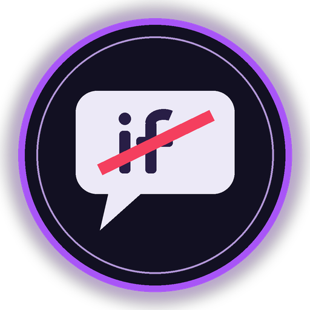

SorryNotSorry does not decide who was right, and it does not judge whether an apology is warm enough. It asks one thing: does the answer hold the speaker to account for what they did — and only such an answer closes the complaint.

<p align="center"></p>

# SorryNotSorry

Grievances that close only when the apology owns the conduct, read by GenLayer validators. GenLayer StudioNet (chain 61999) · py-genlayer v0.2.

**The contract holds no money.** It keeps grievances, every answer with how it was read, and a public standing for each
respondent.

| | |
|---|---|
| Contract source | `contracts/NoIfApology.py` (SHA-256 in `SOURCE_SHA256.txt`) |
| Project deployment | [`0xF4Ca99437E1c3D8c7e72c722067d91D2760c0898`](https://explorer-studio.genlayer.com/address/0xF4Ca99437E1c3D8c7e72c722067d91D2760c0898) |
| Intelligent Contract | NoIfApology — the same frozen source, deployed separately at [`0x8865b318888Bd1BdFc84e25525EBeD2d4308415E`](https://explorer-studio.genlayer.com/address/0x8865b318888Bd1BdFc84e25525EBeD2d4308415E) |
| Evidence | `RUNTIME_EVIDENCE.md` (one tx hash per row) · `TESTING.md` |

## What it does

A complainant files a grievance naming a wallet and the conduct, in one line. Only the named respondent may answer, at
most three times. Validators read each answer once against the complaint and decide one thing:

| | `OWNS_IT` | `DEFLECTS` |
|---|---|---|
| Grievance | **RESOLVED**, for good | stays OPEN, one of three answers used |
| Third DEFLECTS | — | **CLOSED_UNANSWERED**, for good |
| Respondent's standing | resolved by owning +1 | on closing: closed unanswered +1 |

On StudioNet, on one grievance ("Called my pull request lazy in the public channel"),
`I'm sorry that you felt my comment about your pull request was rude.` was read **DEFLECTS** and the grievance stayed
open; `I'm sorry that my comment about your pull request was rude.` was read **OWNS_IT** and resolved it. Two words
apart. A second grievance answered three times without owning anything closed as CLOSED_UNANSWERED.

The same answer cannot be given twice on one grievance; the complainant may withdraw while it is open; a complainant
has one open grievance per respondent at a time. When the reading is unclear, the answer counts as DEFLECTS and the
grievance stays open.

## What the app shows

- **Overview**: the two readings and the standing, with the connected contract.
- **Inbox**: each grievance as a thread — the complaint on top, every answer below with its OWNS_IT or DEFLECTS chip, an
  attempt gauge ("Attempt 2 of 3 next · 2 left") and the RESOLVED or CLOSED_UNANSWERED stamp. The answer box has a byte
  meter; *Answer* is disabled with the contract's own sentence when you are not the named respondent, the grievance is
  closed, or you already gave that answer. The inbox link carries every grievance in it.
- **File a Grievance**: respondent wallet and complaint; the grievance id is shown before you sign.
- **Standing**: any wallet's record — grievances resolved by owning and grievances closed unanswered.
- **Verification**: contract address, source SHA-256 and the rubric hash read from `get_limits`.

After every write the app waits for consensus to accept it, re-reads the contract, and only then reports what happened —
for an answer, how validators read it and what that did to the grievance.

## How to try it

You need **two wallets** on GenLayer StudioNet: a complainant and a respondent. No GEN is spent beyond transaction fees,
and nothing depends on existing data.

1. **Wallet A** — *File a Grievance*: the respondent is wallet B; complaint
   `Called my pull request lazy in the public channel` (write your own if that one already exists between your wallets).
   Copy the inbox link.
2. **Wallet B** — open the link and answer `I'm sorry that you felt my comment about your pull request was rude.`
   It is read DEFLECTS; the gauge shows one answer used. Answer `I'm sorry that my comment about your pull request was
   rude.` It is read OWNS_IT and the thread is stamped RESOLVED.
3. **Wallet A** — open the link: on any open grievance of yours, *Answer* is disabled with "Only the named respondent may
   answer this grievance".
4. File a second grievance and answer it three times without owning it: it closes as CLOSED_UNANSWERED, and *Standing*
   for wallet B counts one of each.

## Methods

| Write | Who | Checks, in order |
|---|---|---|
| `file_grievance(respondent_wallet, complaint)` | anyone | valid wallet → not yourself → complaint 1–120 → no reserved token → no open grievance for the pair → not filed before |
| `answer(grievance_id, text)` | the named respondent | known id → OPEN → respondent → answer 1–200 → no reserved token → not given before → **the only model call** |
| `withdraw_grievance(grievance_id)` | the complainant | known id → OPEN → complainant |

Views return JSON strings: `get_grievance` (every answer with its outcome, attempts and attempts left), `get_standing`,
`get_rubric`, `get_limits`. The full specification is in `LOCKED_SPEC.md`.

## Run locally

```bash
npm ci
npm run dev            # http://localhost:5173 (the /genlayer-rpc proxy is in vite.config.ts)
npm run build && npm test
npm run verify:source
python3 -m pytest tests/contract -q -p no:cacheprovider   # needs genlayer-test 0.29.2
```

`VITE_CONTRACT_ADDRESS` overrides the deployment address. On Vercel, `vercel.json` declares the same proxy.

## Honest limitation

1. **No money, no enforcement off chain.** A resolved grievance is a record, not a remedy.
2. **The complaint is not judged.** Anyone may file a grievance about any wallet; SorryNotSorry only reads the answers.
3. **Words, not hearts.** A ready-made apology that owns the conduct is OWNS_IT.
4. **A wrong OWNS_IT is the main risk** — it closes a grievance on an apology that owned nothing. Nets: unclear readings
   count as DEFLECTS, and a grievance resolves only on a clear OWNS_IT.
5. **The respondent can stay silent** — the grievance then stays open; there is no deadline.
6. **Answers longer than about 161 characters are not proven** (the contract accepts 200); the answer box stops at 255
   bytes of calldata.

License: MIT.
