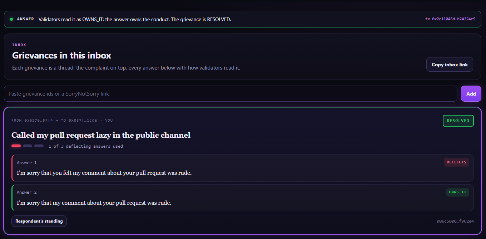
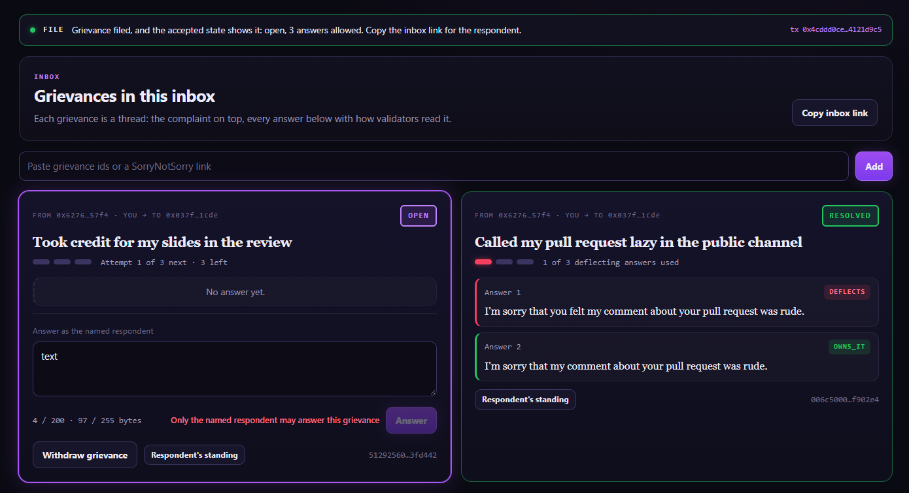
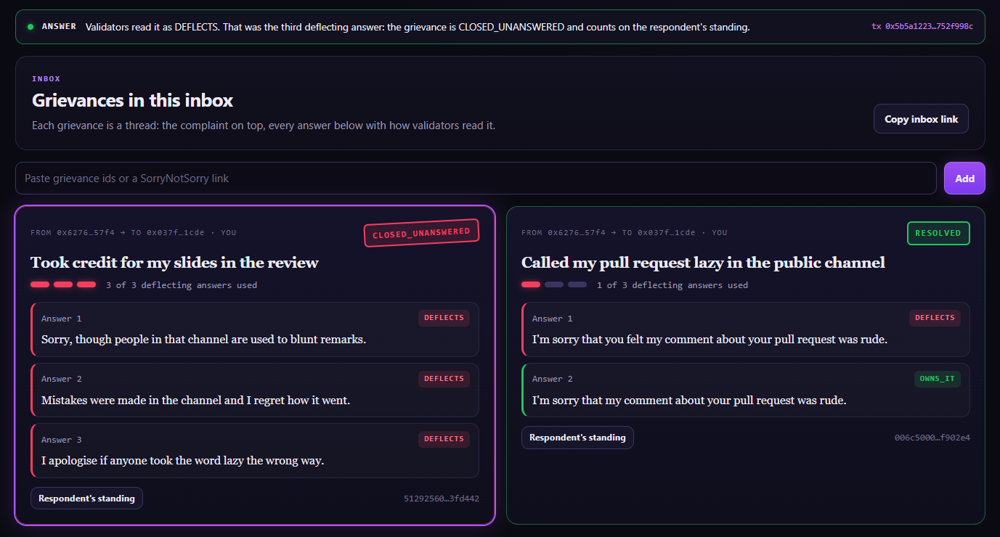

# RUNTIME_EVIDENCE

```
COMPILE PASS ≠ RUNTIME PASS
SUBMITTED ≠ ACCEPTED ≠ FINALIZED ≠ EXECUTION SUCCESS ≠ POSTCONDITION PASS
```

Both deployments run the same frozen source, SHA-256 `4184c9e839a4c647bf8c439f3522e84a76db8c3efe3587718f8d924de321503f`.

## Project run (address `0xF4Ca99437E1c3D8c7e72c722067d91D2760c0898`, through this app)

Run date 2026-10-06, app at https://sorry-not-sorry-zeta.vercel.app, MetaMask on StudioNet. Deploy tx [`0x1199d7ce…61bcd694`](https://explorer-studio.genlayer.com/tx/0x1199d7ce465d77fbf4fce34eb4aaee8a9838a69ae43df77b710615cd61bcd694). **8 transactions**, all executed with SUCCESS.

Wallets: **A** = complainant `0x6276095FAEA15108740445ff277fdA8c304657F4` · **B** = respondent `0x037f58E33c1Ec8fdA272361E0aAC1e31054a1CDE`.
Grievances: G1 `006c50002ab1d414fe2a38474a372aca06b19e3e1f1943e0d3ee41a1ecf902e4` · G2 `51292560fcb1ecf717b1a1e72597f1febac99a2796ff0db30d0a8d5f123fd442` (ids shown by the app before signing).

| # | Wallet | Action in the app | Expected | Tx hash | Result (read back by the app from the accepted state) |
|---|---|---|---|---|---|
| P1 | A | File `Called my pull request lazy in the public channel` against B | G1 OPEN | [`0x92e1366d…4f8f1a58`](https://explorer-studio.genlayer.com/tx/0x92e1366d225ac6c15037ad38fb3a3244839dd9d3a229c99cc508771a4f8f1a58) | SUCCESS; OPEN, 3 answers allowed |
| P2 | B | Answer `I'm sorry that you felt my comment about your pull request was rude.` | DEFLECTS | [`0xb7c2a1fb…8ccbb0e6`](https://explorer-studio.genlayer.com/tx/0xb7c2a1fbea8709e96a2dce558ee9c0b1a8d9c19b8181169143501fc08ccbb0e6) | **DEFLECTS** — "the grievance stays open. 2 answers left." |
| P3 | B | Answer `I'm sorry that my comment about your pull request was rude.` | OWNS_IT | [`0x2e11045d…b24224c9`](https://explorer-studio.genlayer.com/tx/0x2e11045d1c44996fe91a4d3b42c9eed486358ed4f524c99419c42e21b24224c9) | **OWNS_IT** — "The grievance is RESOLVED." |
| P4 | A | File `Took credit for my slides in the review` against B | G2 OPEN | [`0x4cddd0ce…4121d9c5`](https://explorer-studio.genlayer.com/tx/0x4cddd0ce59c5fcd84c707bdd12d51fb8d377ffaa52528d68a98801494121d9c5) | SUCCESS; OPEN |
| P5 | A | Answer box on G2 while connected as the complainant | disabled with *Only the named respondent may answer this grievance* | — (not sent) | disabled with that sentence (screenshot 2) |
| P6 | B | Answer `Sorry, though people in that channel are used to blunt remarks.` | DEFLECTS | [`0x83c33b63…c52924e7`](https://explorer-studio.genlayer.com/tx/0x83c33b63eae5ef62d85274cfc3e0f7b14b5fb2bad6bf3e11d387b9c0c52924e7) | **DEFLECTS**; 2 left |
| P7 | B | Answer `Mistakes were made in the channel and I regret how it went.` | DEFLECTS | [`0xf288eafd…f8782a59`](https://explorer-studio.genlayer.com/tx/0xf288eafdbae094bd47f7699ac2f3107b0542eeecabb77704ddd14494f8782a59) | **DEFLECTS**; 1 left |
| P8 | B | Answer `I apologise if anyone took the word lazy the wrong way.` | DEFLECTS → CLOSED_UNANSWERED | [`0x5b5a1223…752f998c`](https://explorer-studio.genlayer.com/tx/0x5b5a1223c021dc362feca63b41aeba683a0707990c2ad8674e9cf076752f998c) | **DEFLECTS** — "That was the third deflecting answer: the grievance is CLOSED_UNANSWERED and counts on the respondent's standing." |

The app reports an answer only after re-reading both the grievance and the respondent's standing: after P3 the standing
showed one more grievance resolved by owning, after P8 one more closed unanswered (`src/lib/verify.ts`).

Screenshots:







Also: `docs/evidence/1a-deflects-first.png` (the grievance after the first answer).

Predictable reverts (complainant answering, repeated answer, answering a closed grievance) are **not sent** from the app:
the disabled button with the contract's sentence is the evidence.

## Intelligent Contract run (address `0x8865b318888Bd1BdFc84e25525EBeD2d4308415E`, Studio)

Contract [`0x8865b318888Bd1BdFc84e25525EBeD2d4308415E`](https://explorer-studio.genlayer.com/address/0x8865b318888Bd1BdFc84e25525EBeD2d4308415E) · deploy tx [`0x3a5ba8d3…45f611e6`](https://explorer-studio.genlayer.com/tx/0x3a5ba8d3ec23132a84b40e3304950738918334290173d1cf6fb35ac845f611e6) · source SHA-256 `4184c9e839a4c647bf8c439f3522e84a76db8c3efe3587718f8d924de321503f`. Run date 2026-10-06, GenLayer Studio, Normal (Full Consensus). **15 transactions**, all FINALIZED, every one listed below.

Wallets: **A** = complainant `0x6276095FAEA15108740445ff277fdA8c304657F4` · **B** = respondent `0xAD05365aFe0C2450d4FFBcdbE555b6E5fB7Dfa35`.

Grievances (all filed by A against B; id = keccak of complainant, respondent and complaint):

| Grievance | Complaint | Id |
|---|---|---|
| G1 | Called my pull request lazy in the public channel | `3b4ae82aba3e9a12db3d369906071fdd574a7d979856f713b302278d0969b27a` |
| G2 | Mocked my accent in the team meeting | `7f5531d54ed63def077e0c0cb6acc68bd263d9787ec4c7bf23971f1a3fc5c580` |
| G2b | Mocked my accent in the weekly call | `3aa35b349c56bd69747b7e0c7fbe95f98254a5393135482dddd69be349a2cb89` |
| G3 | Took credit for my slides in the review | `1ec8626846744824baa6c5a12d7c2e8828a21f8ac73f366108ab8035fbe112e7` |

| # | Wallet | Call | Expected | Tx hash | Result (read back with `get_grievance`) |
|---|---|---|---|---|---|
| 0 | A | deploy | — | [`0x3a5ba8d3…45f611e6`](https://explorer-studio.genlayer.com/tx/0x3a5ba8d3ec23132a84b40e3304950738918334290173d1cf6fb35ac845f611e6) | SUCCESS |
| 1 | A | `file_grievance(B, G1)` | G1 OPEN, attempts 0 | [`0xe522e855…47f679b9`](https://explorer-studio.genlayer.com/tx/0xe522e8558684bb540a432eb2d7b13b51b6e197ba371d4a11a651d3f847f679b9) | SUCCESS; OPEN, attempts 0, attempts_left 3 |
| 2 | B | `answer(G1, D1)` | DEFLECTS — **Check 1a** | [`0xc940977d…1956573f`](https://explorer-studio.genlayer.com/tx/0xc940977d5f727b24634600ea8a9d9eadb08eb003ae9cf3b7f386d7051956573f) | **DEFLECTS**; still OPEN, attempts 1 |
| 3 | B | `answer(G1, O1)` | OWNS_IT — **Check 1b** | [`0xfbf6dd65…c91b33cc`](https://explorer-studio.genlayer.com/tx/0xfbf6dd651455b01e43a41dda53f0958804687682a0f3efa5c2848636c91b33cc) | **OWNS_IT**; RESOLVED |
| 4 | B | `answer(G1, O2)` | revert *This grievance is no longer open* | [`0x7a77495a…4f31b13c`](https://explorer-studio.genlayer.com/tx/0x7a77495a13db23dba4459de8dfb2f0994b179919a8ea04416deec8394f31b13c) | reverted, *This grievance is no longer open* |
| 5 | A | `file_grievance(B, G2)` | G2 OPEN | [`0xb2a5a6ce…17b0f0e5`](https://explorer-studio.genlayer.com/tx/0xb2a5a6cee28a28afb6c0540f2d26049c55b00134d1802196dccbd91d17b0f0e5) | SUCCESS |
| 6 | A | `answer(G2, O3)` | revert *Only the named respondent may answer this grievance* | [`0x89d95f11…dd6cd499`](https://explorer-studio.genlayer.com/tx/0x89d95f11cd5bef8d796748658562bef7be9946db1c550a71d05327aedd6cd499) | reverted, *Only the named respondent may answer this grievance* |
| 7x | B | `answer(G2, O3)` — **sent by mistake instead of D3** | — | [`0x8c6039b0…5fa2c182`](https://explorer-studio.genlayer.com/tx/0x8c6039b0798d2bc6c096fda40f0ae975b2a6804a72c96382a8d6723b5fa2c182) | **OWNS_IT** (after one leader rotation); G2 RESOLVED with this single answer. D3 was never sent on G2, so Check 2 was rerun on G2b |
| 7a | A | `file_grievance(B, G2b)` | G2b OPEN | [`0x83a9cd1d…f9b14dfa`](https://explorer-studio.genlayer.com/tx/0x83a9cd1dba00650180d2b0edfffebff71402359fce8573307b6defa4f9b14dfa) | SUCCESS |
| 7 | B | `answer(G2b, D3)` | DEFLECTS — **Check 2a** | [`0xaf71d8d7…8f35a113`](https://explorer-studio.genlayer.com/tx/0xaf71d8d7ee104cc4ea0f4d80866557b57dc50f090638e32f0b40693d8f35a113) | **DEFLECTS**; attempts 1 |
| 8 | B | `answer(G2b, O3)` | OWNS_IT — **Check 2b** | [`0xc4c6d92c…da01715d`](https://explorer-studio.genlayer.com/tx/0xc4c6d92c4de7d87eddfb5cfba7a8cf1fff1ed9dd297c125ff9f42597da01715d) | **OWNS_IT**; RESOLVED |
| 9 | A | `file_grievance(B, G3)` | G3 OPEN | [`0x601cec14…91c5e0df`](https://explorer-studio.genlayer.com/tx/0x601cec14a73688145961da9e7873ada3c80e605ea234a463f54351af91c5e0df) | SUCCESS |
| 10 | B | `answer(G3, D4)` | DEFLECTS | [`0x00e6ac11…737ff925`](https://explorer-studio.genlayer.com/tx/0x00e6ac1133facfb6db0d31517df315094d2aa87f48ac2f83582a99c9737ff925) | **DEFLECTS**; attempts 1 |
| 11 | B | `answer(G3, D2)` | DEFLECTS | [`0xc8d1bd41…bd22749e`](https://explorer-studio.genlayer.com/tx/0xc8d1bd4154eb35eb1aabb1d393752061d7d8fce73eb331577bce21b7bd22749e) | **DEFLECTS**; attempts 2 (D2 and D5 were sent in swapped order) |
| 12 | B | `answer(G3, D5)` | DEFLECTS → CLOSED_UNANSWERED — **Check 3** | [`0x8b8e57b1…78e78d04`](https://explorer-studio.genlayer.com/tx/0x8b8e57b147491daf5b6c816dd21c65d975f37ae98e6eb5073653098578e78d04) | **DEFLECTS**; CLOSED_UNANSWERED, attempts 3 |
| 13 | — | `get_standing(B)` | read | — (read) | resolved_by_owning **3**, closed_unanswered **1** (G1, G2 and G2b resolved by owning; G3 closed) |

Must-verify rows:

- **Check 1** — D1 → DEFLECTS and O1 → OWNS_IT on the same grievance (rows 2, 3): **PASS**
- **Check 2** — D3 → DEFLECTS and O3 → OWNS_IT on the same grievance (rows 7, 8, on G2b): **PASS**
- **Check 3** — three DEFLECTS in a row close the grievance as CLOSED_UNANSWERED and the standing ledger counts it (rows 10–13): **PASS**

Notes from the run:

- Row 7x was a slip: O3 was left in the text field and sent on G2 instead of D3. It was read OWNS_IT, which matches its label, and closed G2 after one answer. Because D3 had not been tested, a fresh grievance G2b ran the D3 / O3 pair as planned. The standing ledger therefore shows three grievances resolved by owning instead of two.
- Row 7x went through one leader rotation before validators agreed.

